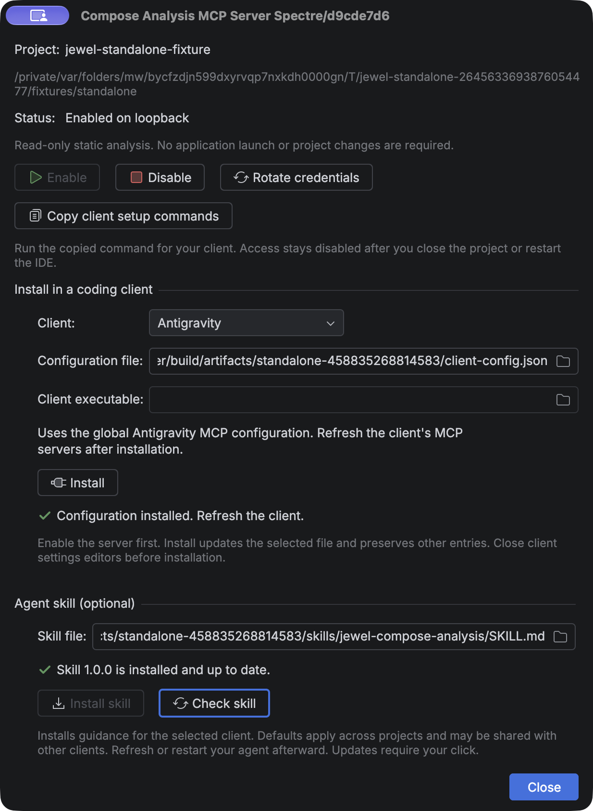

# Use Compose analysis from a coding agent

Jewel Tooling exposes static Compose stability analysis through your running IDE. It uses
the same engine as the editor hints. You do not need to launch your application, add a
build plugin, or change a dependency.

## Enable access to your project

1. Install Jewel Tooling in a supported IntelliJ IDEA installation.
2. Open your own Gradle or Bazel project. Import its Kotlin model and let indexing finish.
3. Open **Tools → Compose Analysis MCP Server…**.
4. Check the project name and path. Select **Enable**.
5. Under **Install in a coding client**, select your client. Check the configuration file
   path.
6. Select **Install**. Jewel Tooling writes and verifies the configuration.
7. Refresh or restart your client. Accept its own trust prompt if shown.

For Codex and Pi, check the **Client executable** field if automatic detection leaves it
empty. You can still select **Copy client setup commands** for manual Codex or Claude Code
setup.

Access defaults to disabled. Enable it again after you close the project or restart the
IDE. The existing client configuration still works. You do not need to copy a new port or
token. The endpoint is separate from live Compose inspection and other IDE MCP servers.

A working Kotlin project model is required. Missing dependencies can produce unknown
findings. Bazel support uses the imported IDE model. It does not run Bazel or guess
dependencies from build files.

## One-click client setup



Install supports these clients. The default scope is your local user configuration. Each
entry selects this IDE profile and project. Other server entries remain unchanged.

| Client | Default configuration | After installation |
| --- | --- | --- |
| Android Studio (Gemini) | Selected Android Studio profile's `mcp.json` | Enable MCP Servers in Studio, then refresh its MCP settings |
| Antigravity | `~/.gemini/config/mcp_config.json` | Refresh MCP servers |
| Codex | `$CODEX_HOME/config.toml`, or `~/.codex/config.toml` | Reconnect MCP or restart the session |
| Claude Code | `~/.claude.json` | Restart the session |
| Pi (pi-mcp-adapter) | `$PI_CODING_AGENT_DIR/mcp.json`, or `~/.pi/agent/mcp.json` | Restart Pi, then inspect `/mcp` |
| Amp | `~/.config/amp/settings.json` or `.jsonc` | Refresh MCP or restart the session |
| OpenCode | `~/.config/opencode/opencode.json` or `.jsonc` | Restart the session |
| GitHub Copilot (JetBrains) | `~/.config/github-copilot/intellij/mcp.json` | Refresh Copilot's MCP servers |
| GitHub Copilot (CLI) | `~/.copilot/mcp-config.json` | Restart the session |
| GitHub Copilot (VS Code) | VS Code's user `mcp.json` | Refresh MCP servers |

The dialog resolves platform paths and relevant configuration-directory overrides. For a
custom client profile, select its actual configuration file. If multiple Android Studio
profiles exist, choose one explicitly. The Studio file must be outside your project, in an
existing profile with an `options` directory. No installation changes a client's global
trust or approval settings.

**Pi support uses pi-mcp-adapter.** If no adapter package is registered, Install runs
`pi install npm:pi-mcp-adapter@2.34.0`. An existing registered adapter is preserved. The
package step needs package-registry access. If you use another Pi extension, ask your
coding agent to adapt the setup. Pi can expose the tools through the adapter's `mcp`
proxy. Use `/mcp` to inspect the connection.

The optional agent skill is documented separately in [Agent skill](skill.md).

### Android Studio and endpoint changes

Android Studio supports HTTP MCP, but not stdio. Its configuration therefore contains a
bearer credential. Jewel Tooling stores that file and its backup with owner-only
permissions. Do not share the Studio configuration or commit it to a repository.

Jewel Tooling updates its owned Studio entry whenever you enable the server or rotate
credentials. On disable, project close, or plugin unload, it revokes access and marks the
entry disabled without a credential. Refresh Studio's MCP settings after an update. An IDE
crash cannot run cleanup, but the old endpoint no longer grants access. Enable again to
refresh the saved entry after a restart. If you edit the entry yourself, automatic updates
stop with a visible warning. Remove only the affected Jewel entry in Studio, then select
Install again.

Other clients use the private discovery bridge. Their saved configurations contain no
token or ephemeral port.

### Existing settings and installation failures

Close client configuration editors before installation. Client applications can also write
their own settings. Jewel Tooling checks for changes before and after each write. It
cannot lock out an unrelated application's writer. If it detects a change, it stops and
asks you to close the editor and retry. A successful installation confirms the saved
configuration, not a live connection inside the external client.

JSON and JSONC installation preserves unrelated text and comments. Duplicate keys and
malformed files are rejected. Jewel Tooling keeps one private backup per destination under
its IDE support directory. It never restores a backup automatically over another
application's changes. Files are limited to 1 MiB, except Claude Code's state file, which
allows 32 MiB. Nesting is limited to 64 levels. Symbolic links and files owned by another
user are rejected. Select a direct, user-owned destination instead.

Codex's installed CLI validates a private copy of its TOML configuration. Installation
appends a new server table and preserves the original text. An unusual inline table, an
old CLI, or a conflicting entry can prevent automatic installation. Use the copied command
in that case. If an IDE move changes the Java path, remove the old named Codex entry and
install again.

Retrying installation is safe. An identical entry is left unchanged; a conflicting user
entry is not overwritten. If Pi installs its package but cannot write the configuration,
retry to finish setup. After deleting or replacing a project, remove its old Jewel entry
from each client. Uninstalling Jewel Tooling does not remove settings from other
applications. Its stopped endpoint denies access.

Formats were checked against the current vendor documentation:
[Android Studio](https://developer.android.com/studio/gemini/add-mcp-server),
[Antigravity](https://antigravity.google/docs/mcp),
[Amp](https://ampcode.com/docs/customize/mcp),
[OpenCode](https://opencode.ai/docs/mcp-servers/),
[Pi adapter](https://github.com/nicobailon/pi-mcp-adapter),
[Copilot IDE clients](https://docs.github.com/en/copilot/how-tos/provide-context/use-mcp-in-your-ide/extend-copilot-chat-with-mcp),
and
[Copilot CLI](https://docs.github.com/en/copilot/how-tos/copilot-cli/customize-copilot/add-mcp-servers).
The [IDE Index MCP plugin](https://github.com/hechtcarmel/jetbrains-index-mcp-plugin)
informed the setup workflow. No source code was copied.

## Manual setup for Codex or Claude Code

The IDE copies commands with the correct Java executable, bootstrap path, descriptor path,
and project identity. The following paths are **examples**. Use the copied values for your
own installation.

```sh
codex mcp add jewel-example -- '/path/to/ide/jbr/bin/java' -jar '/private/support/bootstrap.jar' '/private/support/project.properties' 'PROJECT_ID'
claude mcp add --transport stdio jewel-example -- '/path/to/ide/jbr/bin/java' -jar '/private/support/bootstrap.jar' '/private/support/project.properties' 'PROJECT_ID'
```

Run only the command for your client. Restart its session or reconnect the server through
its MCP controls. The commands use the documented
[Codex MCP syntax](https://developers.openai.com/codex/mcp/) and
[Claude Code stdio syntax](https://code.claude.com/docs/en/mcp). Their argument forms were
checked against the installed CLIs.

For a configuration file, use the same values. This Codex TOML is an **example**:

```toml
[mcp_servers.jewel_example]
command = "/path/to/ide/jbr/bin/java"
args = ["-jar", "/private/support/bootstrap.jar", "/private/support/project.properties", "PROJECT_ID"]
```

This Claude Code JSON is an **example**:

```json
{
  "mcpServers": {
    "jewel_example": {
      "type": "stdio",
      "command": "/path/to/ide/jbr/bin/java",
      "args": ["-jar", "/private/support/bootstrap.jar", "/private/support/project.properties", "PROJECT_ID"]
    }
  }
}
```

The copied shell commands use POSIX quoting. On Windows, use the JSON configuration with
escaped backslashes or forward slashes. The launcher uses your IDE's bundled Java runtime.
Copy setup again if you move or remove that IDE installation. Each descriptor selects one
IDE profile and one project. Give separate endpoints separate client names. Do not replace
a project identity with another project's identity. The bridge never selects the first
running IDE. If you move or recreate the project, copy its setup again.

The client starts a local stdio bridge. That bridge reads private discovery data and
connects to authenticated loopback HTTP. The descriptor contains a credential. Do not
share it or add it to version control. The copied configuration contains no credential. A
new enable operation creates a new credential and endpoint generation.

## First analysis in your project

Ask your agent to follow this sequence. Tool names can have a client-specific prefix.

1. Call `jewel_status` with `{}`. Check `projectRoot`, `projectId`, and `readiness`.
2. Call `jewel_composables` with `{"file":"src/main/kotlin/example/Screen.kt"}`.
3. Select a returned declaration ID. Call `jewel_analyze` with the same file and that
   `declarationId`.
4. Call `jewel_explain` with the file, declaration ID, and parameter name.
5. Cite the declaration location, document hash, classification, evidence, and reason in
   your explanation.

These requests are **examples**:

```json
{"file":"src/main/kotlin/example/Screen.kt","declarationId":"GENERATION:FILE_HASH:CONTENT_HASH:OFFSET"}
```

```json
{"file":"src/main/kotlin/example/Screen.kt","declarationId":"GENERATION:FILE_HASH:CONTENT_HASH:OFFSET","parameter":"items"}
```

Use the actual returned ID. For an extension receiver, use the parameter name
`<receiver>`. The explain tool describes a parameter's resolved type in context. It does
not resolve arbitrary type strings.

All results use this envelope. The following is a **representative excerpt**, not a
complete response:

```json
{
  "schemaVersion": 1,
  "payload": {
    "kind": "result",
    "data": {
      "file": "src/main/kotlin/example/Screen.kt",
      "documentRevision": "42",
      "contentHash": "SHA256_OF_CURRENT_DOCUMENT",
      "declarations": [{
        "name": "Screen",
        "parameters": [{
          "name": "items",
          "resolvedType": "kotlin.collections.List<example.Item>",
          "stability": "UNSTABLE",
          "evidence": [{"code": "BUILTIN", "provenance": "builtin"}],
          "reasons": [{"code": "reason.collection", "text": "The collection type does not guarantee immutability.", "locations": []}],
          "incomplete": []
        }],
        "skippability": "NOT_ANALYZED"
      }]
    }
  }
}
```

## Contract and evidence

The four tools are read-only. Their `inputSchema` and `outputSchema` are available through
MCP tool discovery. Each success has `schemaVersion: 1` and a `payload` with
`kind: "result"` and `data`. Each operational error has `kind: "error"`, `code`,
`message`, `retryable`, and `remedy`. MCP also sets `isError`. Both shapes conform to the
published output schema.

`jewel_status` reports versions, project identity, readiness, capabilities, and limits.
The three analysis tools return a document snapshot with declaration and parameter
details. `jewel_composables` includes stability summaries. `jewel_explain` narrows the
parameter details to the selected parameter.

Every snapshot includes the document revision, SHA-256 content hash, and PSI revision.
Declaration IDs belong to the endpoint generation, canonical project-relative file, and
document hash. Locations use one-based lines and columns, counted in UTF-16 code units.
Range ends are exclusive.

`jewel_analyze` analyses the named file when no selector is supplied. A range selects
declarations whose names begin inside it. A zero-width range selects the innermost
containing function. A range and a declaration ID cannot be used together. All three
analysis tools accept an optional `expectedHash` to reject changed documents.

| Evidence | Meaning |
| --- | --- |
| `COMPILER_METADATA` | Supported compiled metadata contributes to the classification |
| `DECLARED_CONTRACT` | The resolved type declares a stability annotation contract |
| `SOURCE` | The engine infers stability from supported source declarations |
| `BUILTIN` | The engine applies a known language or library rule |
| `UNSUPPORTED` | The available evidence does not support a conclusion |

Evidence can be mixed. Keep every evidence entry when explaining a result. A declared
contract is not proof that the implementation satisfies it. Do not add `@Stable` or
`@Immutable` merely to silence a finding. These annotations promise behaviour that the
implementation must preserve.

`UNKNOWN` remains unknown. An incomplete entry explains missing metadata, unresolved
types, unsupported evidence, or an analysis budget. Missing metadata is a partial finding,
not a failed whole-file request. Stability does not prove compiler skippability, a
recomposition count, or a performance problem. The server returns no runtime observations.
`skippability` is `NOT_ANALYZED`.

## Unsaved edits and limits

Analysis uses the current editor document, including unsaved edits. It does not save your
source file. A write can invalidate the snapshot. On `STALE_LOCATION`, list declarations
again and use the new ID. Dependency changes can invalidate conclusions even when the
source hash stays unchanged. Request fresh analysis before making a claim.

Each request names one project-relative Kotlin file. No tool scans your repository
implicitly. The limits are 1 MiB of source, 128 declarations, 256 parameters, and 1 MiB of
encoded output. Two analyses can run per project. Additional analyses return `BUSY`. The
deadline is ten seconds. Requests that exceed a limit fail explicitly. The server does not
silently omit declarations.

Client cancellation stops the request. A cancelled MCP request need not receive a
response. Closing a session cancels its analyses. A dropped HTTP connection alone is not a
cancellation signal. Disconnected analysis still has a deadline. Idle sessions expire and
do not consume capacity indefinitely.

## Disable or rotate access

Select **Disable** in the server dialog to revoke access and stop the endpoint. Closing
the project or unloading the plugin also stops it. Select **Rotate credentials** to
replace credentials and end existing sessions. Reconnect the client afterward. Stdio
clients keep the same discovery path. Jewel Tooling updates its owned Android Studio
entry; refresh Studio after rotation.

## Troubleshooting

| Symptom | Action |
| --- | --- |
| The bridge cannot connect | Open the selected project, enable MCP, and reconnect the client |
| `INDEXING` | Wait for indexing to finish; check `jewel_status` again |
| `UNKNOWN` with unresolved evidence | Fix or import the Kotlin dependency model; request fresh analysis |
| `METADATA_UNAVAILABLE` in a parameter | Keep the result unknown; compiler evidence is not available for that classification |
| `STALE_LOCATION` | List composables again; use the new declaration ID and hash |
| `BUSY` | Let an existing request finish before retrying |
| `TIMEOUT` | Wait for the IDE to become idle or analyse a smaller range |
| `LIMIT_EXCEEDED` | Analyse a smaller file, range, or declaration |
| `OUTSIDE_PROJECT` | Use a file inside the selected imported project |
| The wrong project appears in status | Remove that client entry and copy setup from the intended project's dialog |
| Setup fails on permissions | Use an owner-only IDE configuration directory; do not make the discovery files public |
| Access stops after rotation or restart | Re-enable if needed, then reconnect the client with its existing configuration |
