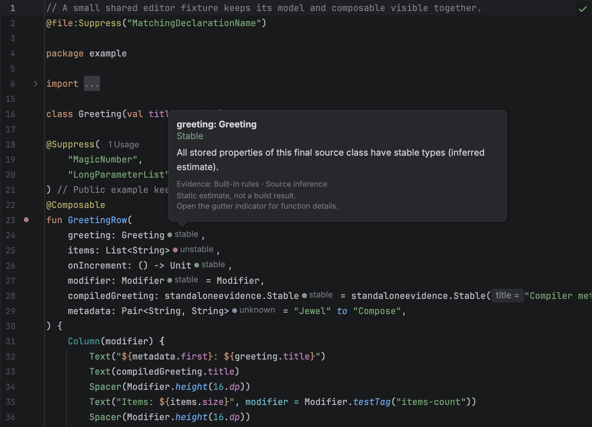
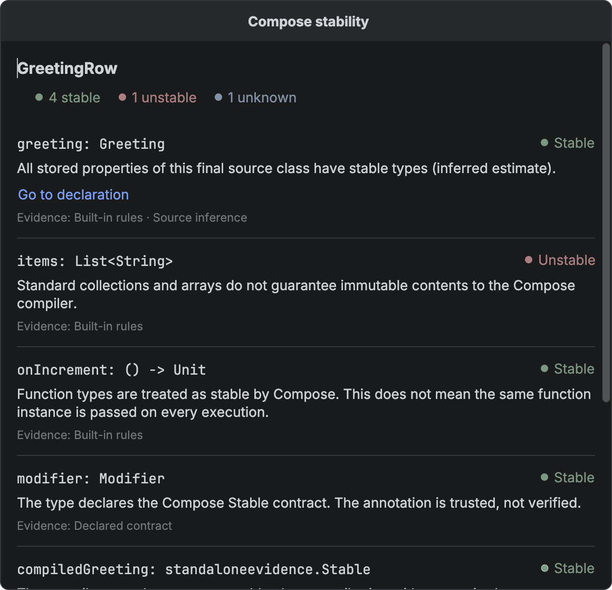
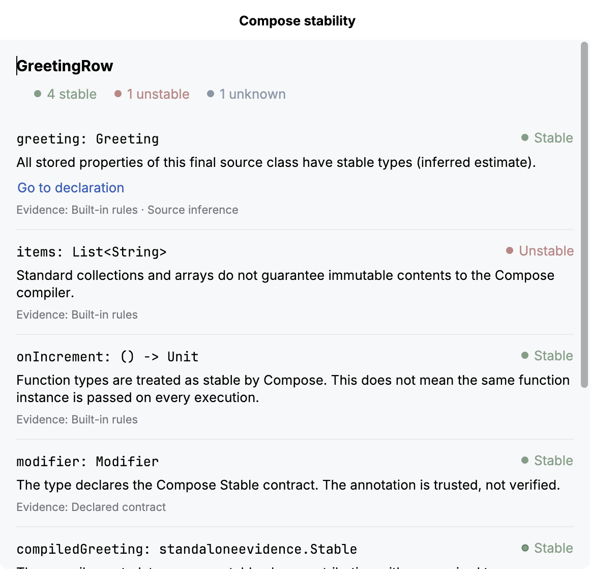

# Editor hints

Jewel Tooling shows a static stability estimate beside each parameter of a Kotlin
`@Composable` function. Hover a hint to see its reason. Click the function’s gutter
indicator to inspect every input.

These are conservative estimates, not Compose compiler reports. A stability result does
not say whether a function will recompose. With strong skipping, an unstable parameter can
still permit skipping when its relevant identity has not changed.

## What a hint means

| Hint | Meaning |
| --- | --- |
| stable | A recognized stable type, a trusted Compose stability contract, an inferred final source class whose stored properties have stable types, or supported compiler metadata with stable selected type arguments. |
| unstable | A standard collection or array, a vararg, a class with a mutable or unstable stored property, or a supported compiler metadata result that proves instability. |
| unknown | The type is unresolved, outside the supported inference rules, or too expensive to analyse within the fixed budget. |

The explanation tells you which rule produced the estimate. `@Stable` and `@Immutable` are
contracts: the plugin trusts them and does not prove that their promises are valid. Do not
add either annotation only to change a hint.

Each hint has a small circle and a text label. Green means stable, muted red means
unstable, and blue-grey means unknown.

A plain circle means that the result uses inference, a built-in rule, or a declared
contract. A circle with a 1-point border means that supported compiler metadata confirms
the type's stability. Mixed evidence stays borderless. For example, a source class does
not gain a border because one property has compiler metadata. The border does not say
whether a composable can be skipped.

The text uses the IDE's standard inlay text colour. Unknown results currently stay
borderless. To change colours, see [Customisation](customisation.md).

## Inspect a function

Click the gutter indicator beside a composable function to open **Compose stability**. The
popup shows the function name, status counts, and each input’s source type, explanation,
and evidence. Evidence labels distinguish built-in rules, declared contracts, source
inference, and compiler metadata. A generic type can combine several kinds of evidence.

These are input estimates, not a verdict that the function is skippable.

To open the same view from the keyboard, place the caret inside the function, open
**Find Action**, and choose **Inspect Compose Stability**. The action is also in the
editor context menu. You can select and copy explanation text, scroll through longer
parameter lists, and resize the popup. Press **Escape** to return to the editor. Editing
the source or switching editors closes the popup so it cannot keep showing an outdated
result.

Choose **Go to declaration** when an explanation offers it. The editor opens the
responsible property or the inferred stable class. Nested explanations can lead to a
property inside another source class. Targets come from resolved declarations in the same
IDE module. The link is available by keyboard and includes the parameter name for screen
readers.

Navigation stops if indexing starts or any project source changes after the analysis.
Close and reopen the details to refresh the targets. A missing link means that the
explanation has no supported source target. Compiler text and binary metadata do not
become guessed source links.

Counts include value parameters and an extension receiver, when present. Context
parameters are not analysed. Functions with no covered inputs show that explicitly. An
unstable input takes precedence in the gutter icon; otherwise an unknown input takes
precedence over stable inputs.

## Compiler evidence

For a resolved binary dependency, the plugin can read the class’s existing Compose
stability metadata. It reads the class file without loading or executing it. You do not
need to add a plugin or dependency to the project being inspected.

The reader accepts Kotlin metadata `[2, 3, 0]` and `[2, 4, 0]` in Java 8–25 class files.
It rejects preview class files. The
[testing guide](https://github.com/rock3r/jewel-tooling/blob/master/docs/testing.md#compatibility)
lists the compiler configurations that produce those fixtures.

A metadata version does not identify the compiler patch version. Computed stability
initializers and other unsupported shapes stay **unknown**. Other metadata versions and
class files newer than Java 25 also stay **unknown**. This does not provide general
coverage of published Jewel or Compose libraries.

For generic classes, the metadata identifies which type arguments matter. For example, a
compiled `Box<T>(val value: T)` combines the compiler’s class result with the analysis of
`T`. A star projection stays unknown when that argument is required. An unused type
argument does not affect the result. The details view labels compiler and source evidence
separately when both contribute.

These class results do not establish whether a function is restartable or skippable.
Stability configuration files are not read. A dependency without supported metadata can
still be stable through a recognized `@Stable` or `@Immutable` contract.

## Limits

The provider covers value parameters and extension receivers. It does not show
context-parameter hints. Explicit `FunctionN` class references can remain unknown even
when function syntax such as `() -> Unit` is stable.

The plugin does not interpret external stability configuration files or custom and
inherited stability contracts. It leaves unannotated library types such as `Pair` and
`Triple` unknown. Singleton objects and value classes, including unsigned types, are also
unknown unless a recognized contract applies.

Generic substitution handles concrete stored types. Repeated instantiations of the same
class, such as `Box<Box<String>>`, conservatively stop at the recursion guard. Recursive
types remain unknown. Inner and local classes also remain unknown because they can capture
state outside their declared properties. Computed properties without backing fields and
companion state do not count as instance storage. Delegated storage is unknown.

Analysis processes the extension receiver, then parameters in declaration order. It stops
after 256 type visits for a function or a nesting depth of 12. Earlier completed hints
remain. Exhausted assessments say unknown and explain the budget limit. Binary reads also
stop at 1 MiB per class, 4 MiB per function, or 32 distinct class files. No result is
retained across editing passes.

## Missing hints

Wait for indexing and Gradle synchronization to finish. Check that
`androidx.compose.runtime.Composable` resolves in the editor and that the function has
explicit parameter types. An unrelated annotation named `Composable` does not activate the
provider.

Check the inlay setting under [Customisation](customisation.md). An unknown result is
useful evidence of an unsupported case. It is not a claim that the type is unstable.
Include a small public reproduction when reporting a result you believe is wrong.
