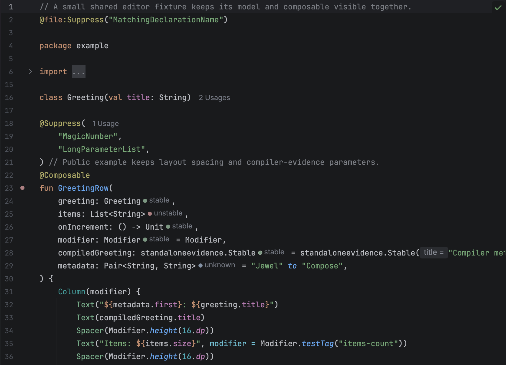
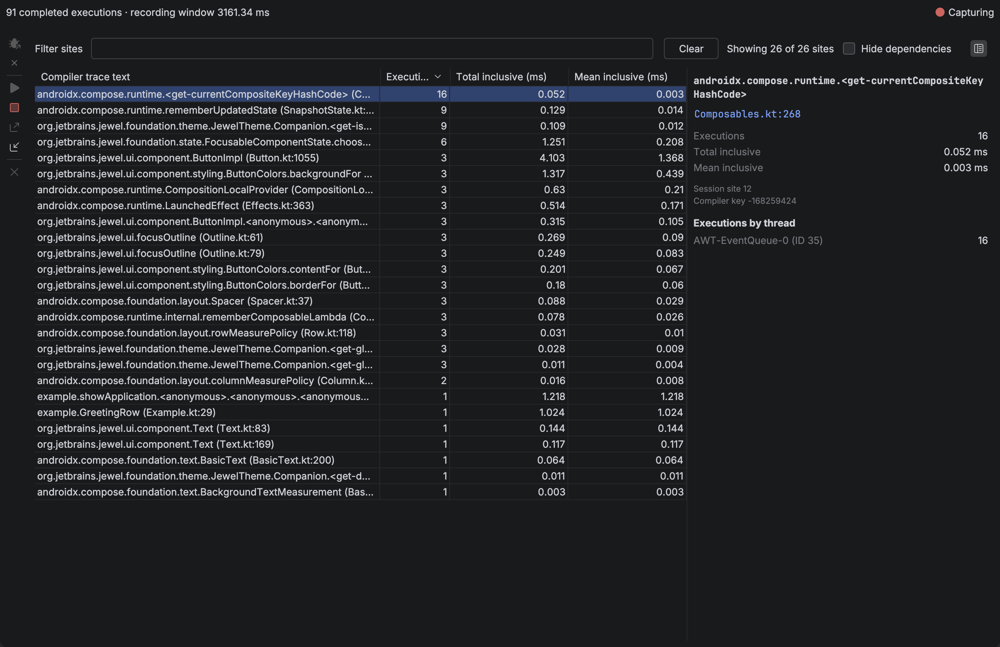

# Jewel Tooling

Jewel Tooling is an IntelliJ IDEA plugin for Compose UI authors. It shows a static
stability estimate beside each `@Composable` parameter, and it can record live composition
activity from a local development run.

You do not add a dependency, change application source, or start a server for the editor
hints. Live inspection uses a bundled agent on a temporary copy of a run configuration you
already have.

This is the 0.9.0 distribution. It targets IntelliJ IDEA 2026.2.0.1 (build 262.8665.337)
with the bundled Kotlin plugin in K2 mode. Install it from
[JetBrains Marketplace](https://plugins.jetbrains.com/plugin/34392-jewel-tooling), from a
[GitHub Release](https://github.com/rock3r/jewel-tooling/releases), or from the ZIP built
in this repository.

## What you get

Editor hints appear after parameter types in project sources and in attached dependency
Kotlin sources. Hover a hint for its reason. Click the function gutter icon for every
input in one place.

**Run with Compose Inspection** starts your selected configuration, connects, and fills
the **Live recompositions** tab as you use the UI. Inclusive duration badges appear at the
end of matching function or property lines. Those times include nested calls and capture
overhead. They are not frame times, and they do not prove a skip or a performance problem.

## Start here

| Page | Use it to |
| --- | --- |
| [Install](install.md) | Build or install the plugin and open a Gradle or Bazel project |
| [Editor hints](editor.md) | Read stability estimates, evidence, and limits |
| [Live inspection](live-inspection.md) | Launch, capture, filter, and stop a local session |
| [Recordings](recordings.md) | Open a saved session and read its measurements |
| [Customisation](customisation.md) | Change hint colours, gutters, and inlay visibility |
| [Agents](agents/index.md) | Use the same static analysis from a coding agent |

Contributors: start at
[CONTRIBUTING.md](https://github.com/rock3r/jewel-tooling/blob/master/CONTRIBUTING.md).
Internal architecture, testing, and conventions live under
[docs/](https://github.com/rock3r/jewel-tooling/blob/master/docs/architecture.md).
