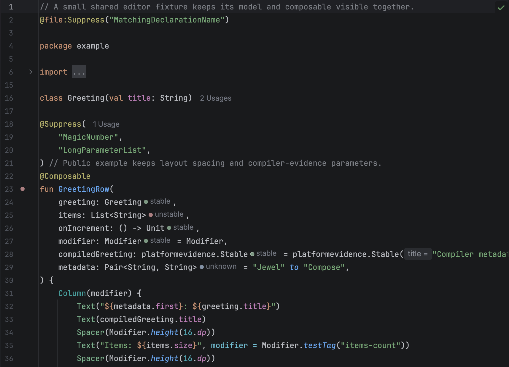

# Install the plugin

Install Jewel Tooling from
[JetBrains Marketplace](https://plugins.jetbrains.com/plugin/34392-jewel-tooling) in
IntelliJ IDEA 2026.2, from a
[GitHub Release](https://github.com/rock3r/jewel-tooling/releases), or build the ZIP with
JDK 25 and install it from disk. The plugin bytecode targets JVM 21. The IDE that hosts it
uses JBR 25.

```sh
./gradlew :buildPlugin
```

In IntelliJ IDEA, open **Settings → Plugins**, choose the gear menu, then
**Install Plugin from Disk**. Select `build/distributions/jewel-tooling-0.9.0.zip` and
restart when prompted.

To use an existing compatible IDE instead of downloading one for the build:

```sh
./gradlew -PlocalIdePath=/path/to/IntelliJIDEA.app/Contents :buildPlugin
```

There is no upper IDE build limit, so a newer IDE can install the plugin. Only build
262.8665.337 has been validated. Newer IntelliJ IDEA and Android Studio builds may need
API compatibility fixes.

## Open a project

Import the Gradle or Bazel project you want to inspect and let synchronization and
indexing finish. The IDE must resolve Compose annotations and the parameter types. Jewel
Tooling reads those resolved roots and dependencies. It does not run Bazel or parse build
output during editing.

For a Gradle application such as Jewel Standalone, import the Gradle project normally.

For a Bazel project, use the project's supported IntelliJ model. Bazel build files alone
do not define the IDE's source roots, classpaths, or Kotlin compiler options. The model
should include the Compose compiler plugin used by the build, especially for libraries
that use Kotlin 2.4 composable function types.

Kotlin Multiplatform source-set models are untested. Unannotated types in another source
module remain unknown. Supported compiled dependencies can use compiler metadata.



Opening a dependency Kotlin file, such as Compose runtime source, shows the same parameter
hints, function gutter icon, and live duration badges as a project file. Decompiled class
files without source still have no hints.

The Gradle wrapper in this repository builds the IDE plugin. It does not impose a build
system on the project being analysed.
