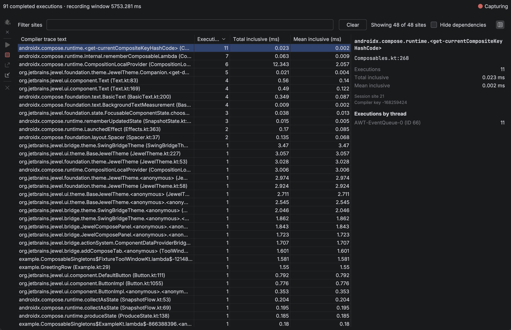

# Live inspection

Select the run configuration you normally use to start a Compose UI, then choose
**Run with Compose Inspection**. The plugin launches a temporary copy of that
configuration, connects to its target, and starts capture when Compose loads.

The target must use a local JVM of version 21 or newer. You do not add a dependency,
change application source, or copy a connection token.

## Launch

1. Choose **Run with Compose Inspection** from the run widget (beside Run and Debug), the
   configuration gutter, or **Run → Run with Compose Inspection**. The default shortcut is
   Ctrl+Alt+Shift+F10, or Ctrl+Option+Shift+R on macOS.
2. Use your application. Execution counts update on the **Live recompositions** tab in the
   **Compose Inspection** tool window.
3. Click **Stop Capture**, then **Export Recording** to save the result. A notification
   can reveal the saved file in the system file manager. **Import Recording** loads a
   saved file into this tab and the editor badges. **Close Recording** clears that
   session.

**Tools → Install Inspection Support** can prepare the agent without launching.

The launch uses a temporary copy of your configuration. Its existing build steps run
before the application starts. Your saved configuration stays unchanged. A normal **Run**
starts your application without the inspection agent.

The plugin does not connect to remote hosts.

### Jewel Standalone and Gradle

Select a Gradle run configuration with one explicit application task, such as
`:desktop:run`. Use the full task path when different modules have tasks with the same
name. The task must be a `JavaExec` task. A task that only delegates to another task is
not sufficient. Included Gradle plugin builds that run while the project configures are
ignored until that application task is in the task graph.

The plugin adds the agent to that application's JVM. It does not add it to the Gradle
daemon. The temporary launch disables Gradle's configuration cache. Your project's
configuration stays unchanged. Remote targets, compound configurations, and `runIde` split
mode are not supported.

### IntelliJ Platform and Bazel

Open the project's supported IntelliJ model and select its local **Application** or
**Kotlin** run configuration. Keep the normal Bazel build step in that configuration, if
the project requires one. Then choose **Run with Compose Inspection**.

The selected configuration must start the target IDE in a separate JVM. Open the plugin UI
in that target IDE and interact with it to produce trace events. The
**Compose Inspection** tool window in the authoring IDE receives those events. JBR 25 is
supported by the agent's bytecode reader.

The plugin does not convert an arbitrary Bazel command into an IDE launch configuration.
Use the project's existing configuration that already starts its development IDE.

## Read the live capture

The **Live recompositions** tab shows capture state, completed execution count, and
recording window. Select a trace site to inspect its details in the side pane. Filter the
table, with completion from recorded compiler text, to focus on one composable.

The table starts sorted by executions, highest first. Double-click a row to open its
Kotlin file when that file resolves. Choose **Hide dependencies** to keep sites whose
files are in this project's source and hide Compose, Jewel, and other library sites.

Matching Kotlin files in this project or its dependencies show inclusive duration as a
badge at the end of the matching function or property line. Hover it for its share of
recorded inclusive time and the execution count. The value uses the same millisecond
format as the live table. Click a duration badge to select that site in the tool window.
Click a file name in the details pane to open that Kotlin file when it resolves.

The recording window is elapsed capture time. Inclusive durations also contain nested
calls.

**Waiting for Compose** means that the connection exists but the target has not loaded its
Compose runtime yet. Open a Compose surface in the target. Capture starts automatically
when a supported runtime becomes available. An unsupported runtime or multiple runtime
copies stop capture with an explanation. The agent captures trace callbacks on the
composition thread. Pairing, site totals, and the event log run on a low-priority
background thread so composition stays off the recording store.

## Stop, disconnect, and limits

**Stop Capture** stops recording and leaves your application running.
**Disconnect Target** closes inspection and also leaves the application running. Run with
inspection again to create another connection after disconnecting. Use the normal **Stop**
control in the Run tool window to stop the application itself.

Hover the capture status to read why a limit stopped recording. The session stops after
100,000 completed executions, 1,024 sites, 64 threads, depth 64, or one hour.

Starting another capture asks before discarding a nonempty, unexported result. If capture
has already ended, **Cancel** keeps that result. **Keep Recording** is only offered while
capture is still running. A confirmed final result remains exportable after disconnecting.
Disconnecting during capture leaves an incomplete snapshot, which cannot be exported as a
final recording.

**Import Recording** and **Tools → Open Compose Recording** load a saved file into this
tab. That replaces the current result and disconnects a live target. **Close Recording**
clears the current result and its duration badges. Both actions ask before discarding a
nonempty unexported result.

The live view does not identify initial composition, skipped calls, invalidation causes,
or composition instances. Missing compiler trace markers can hide activity. An empty live
view does not prove that the application is idle.

A session accepts at most 100,000 completed executions, 1,024 sites, 64 threads, and a
nesting depth of 64. Compiler text is limited to 1 KiB per site. Files are limited to 24
MiB, and the recording window is limited to one hour. Live snapshots send per-site totals;
the full event list is read from the target when capture stops. Reaching a limit ends
capture and marks the result **Truncated**. The recorder discards unfinished root segments
and reports their counts. Later activity is unrecorded; its extent is unknown. Clock
failures produce **Failed** recordings. The report preserves completed events from before
the failure.

Target, compiler, runtime, and build labels are declarations. They do not prove a build
identity. Runtime classloader identity remains unknown. Sessions are not merged.

Live inspection uses an authenticated loopback connection to the configured development
target. Automatic launches use a startup agent to observe Compose trace callbacks. The
older manual recorder adapter is a contributor-only path; see
[Recording adapter](https://github.com/rock3r/jewel-tooling/blob/master/docs/recording-adapter.md).
