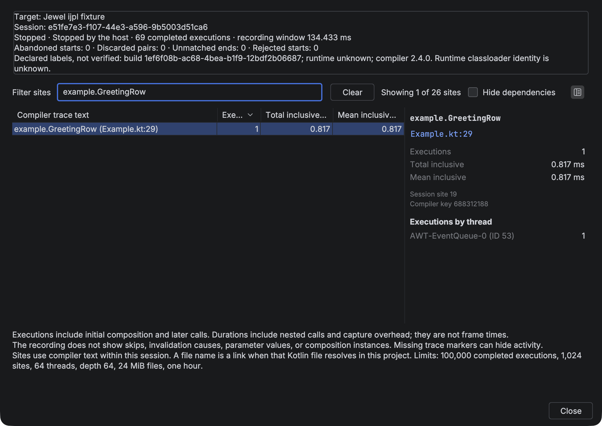

# Recordings

Choose **Tools → Open Compose Recording**, **Import Recording** on the
**Live recompositions** tab, or find that action with **Find Action**. Select a file
exported by **Run with Compose Inspection**, or one produced by the repository fixtures.

The saved session fills the **Live recompositions** tab. Matching Kotlin files show the
same inclusive duration badges as a live capture. Click a column heading to sort the
sites. Select a site to see its declaration, file link, measurements, and executions by
thread. You can select and copy the text. **Close Recording** clears the session and its
badges.

Opening a recording disconnects a live target. Opening or closing asks before discarding a
nonempty unexported result. A saved file is already exported, so closing it does not ask.




## Filter and navigate

Use **Filter sites** to find text in the full compiler trace description. Matching ignores
case and treats punctuation and spaces literally. Press Ctrl+Space in the field to
complete from recorded compiler text, declaration names, and file names. For example,
enter `example.GreetingRow` to find that call site. Choose **Clear** to restore all rows.

Choose **Hide dependencies** to hide library sites whose files are not in this project's
source. The result count shows visible sites out of all recorded sites. Filtering does not
change session totals or per-site measurements.

The table starts sorted by executions, highest first. Double-click a row, or click a
resolved file name in the details pane, to open that Kotlin file.

An execution is a completed pair of Compose trace callbacks. It can be an initial
composition or a later call. The callback does not identify which occurred. Total and mean
durations include nested calls and capture overhead. They are not frame times.

A site combines the compiler key and its exact text within one session. Matching function
names do not prove matching composition instances. A file name in the details pane is a
link when that Kotlin file and package resolve in this project or its dependencies.
Unresolved names stay plain text. The recording still has no verified source map.

The report does not show skips, invalidation causes, parameter values, or composition
instances. Missing or disabled trace markers can hide activity. An empty recording does
not prove that the target did no work.

The importer rejects malformed, incomplete, oversized, and unsupported files. It treats
compiler text as plain text, never as paths or commands. Saved files stay local.

## Fixture recordings

The automated demos below create a saved recording without using the live controls. Use
them to check the repository setup or to try the saved report. They run an automated
graphical test, not your application.

Use JDK 25 and a display. From the `jewel-tooling` repository root:

```sh
./gradlew :e2e:driver-plugin:exportFixtureSdk
./gradlew -p fixtures/standalone test
```

The test launches the demo, starts capture, clicks **Add item**, stops capture, and saves
`fixtures/standalone/build/capture/recording.json`. In your IDE, choose
**Tools → Open Compose Recording** and select that file.

For the Bazel and IJPL demo, follow the
[testing guide](https://github.com/rock3r/jewel-tooling/blob/master/docs/testing.md). Each
IJPL scenario saves `recording.json` in its artifact directory under
`e2e/runner/build/artifacts`.
